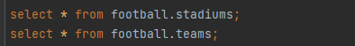

<div align="center">


  
  <h1>DataBase Project</h1>
  
  <p>
    Project on the course "DataBases", PSAMI, MIPT, 2022 
  </p>

<!--  
Badges
<p>
  <a href="https://github.com/Louis3797/awesome-readme-template/graphs/contributors">
    
  </a>
  <a href="">
    
  </a>
  <a href="https://github.com/Louis3797/awesome-readme-template/network/members">
    
  </a>
  <a href="https://github.com/Louis3797/awesome-readme-template/stargazers">
    
  </a>
  <a href="https://github.com/Louis3797/awesome-readme-template/issues/">
    
  </a>
  <a href="https://github.com/Louis3797/awesome-readme-template/blob/master/LICENSE">
    
  </a>
</p>
   
<h4>
    <a href="https://github.com/Louis3797/awesome-readme-template/">View Demo</a>
  <span> · </span>
    <a href="https://github.com/Louis3797/awesome-readme-template">Documentation</a>
  <span> · </span>
    <a href="https://github.com/Louis3797/awesome-readme-template/issues/">Report Bug</a>
  <span> · </span>
    <a href="https://github.com/Louis3797/awesome-readme-template/issues/">Request Feature</a>
  </h4>
</div>
-->

<br />

<!-- TABLE OF CONTENTS -->
# :notebook_with_decorative_cover:
<details open="open">
  <summary><h2 style="display: inline-block">Table of Contents</h2></summary>
  <ol>
    <li>
      <a href="#about-the-project">О проекте</a>
      <ul>
        <li><a href="#goals">Цели</a></li>
        <li><a href="#motivation">Мотивация</a></li>
      </ul>
    </li>
    <li>
      <a href="#conceptual-model">Концептуальная модель</a>
      <ul>
        <li><a href="#relations">Сущности</a></li>
      </ul>
    </li>
    <li><a href="#logical-model">Логическая модель</a></li>
    <li><a href="#physical-model">Физическая модель</a></li>
    <li>
      <a href="#practise">Практическая часть</a>
      <ul>
        <li><a href="#files">Файлы проекта</a></li>
        <li><a href="#examples">Примеры из запросов</a></li>
      </ul>
    </li>
    <li><a href="#problems">Проблемы</a></li>
    <li><a href="#conclusion">Итоги</a></li>
    <li><a href="#license">License</a></li>
    <li><a href="#contact">Contact</a></li>
    <li><a href="#acknowledgements">Ресурсы</a></li>
  </ol>
</details>

<!-- About the Project -->
## :star2: О проекте


<!-- Goals -->
### :dart: Цели
***Цели:*** Главная цель нашего проекта получить необходимые
знания проектирования БД. Углубленно изучать все модели
проектирования: концептуальное, логическое и физическое. Применить полученные знания на практике с промышленными СУБД Научиться делать грамотные запросы, создавать
хранимые процедуры и тригерров.

<!-- Motivation -->
### :space_invader: Мотивация
***Мотивация:*** Мотивацией проекта получить необходимые практические и теоретические знания о базе данных и завершить свой проект. Так как Я очень люблю футбол, то это для меня идеальный шанс совмещать футбольный мир с технологии БД.

<!-- Conceptual Model -->
## 	:toolbox: Концептуальная модель
<br>

<br>

<!-- Relations -->
### :bangbang: Сущности
```sh
    - Команды турнира
    - Стадионы команд
    - Игроки команд
    - Контракт игроков
    - Матчи турнира
    - Результаты команд
    - Статистика матчей
```

<!-- Logical Model -->
## 	:gear: Логическая модель
<br>

<br>
### :eyes: Примечание
Все таблицы находятся в 2-НФ.

<!-- Physical Model -->
## 	:test_tube: Физическая модель
**Stadiums**
Название |Описание | Тип данных | Ограничение|
------ | ------|------|------|
stadium_id | Индентификатор стадиона | SMALLINT | PRIMARY KEY
full_nm | Название стадиона | VARCHAR(32) | NOT NULL
capacity_no | Вместимость стадиона | INTEGER | NOT NULL

**Teams**
Название |Описание | Тип данных | Ограничение|
------ | ------|------|------|
team_id | Индентификатор команды | SMALLINT | PRIMARY KEY
stadium_id | Индентификатор стадиона | SMALLINT | FOREIGN KEY
club_desc | Название команды | VARCHAR(25) | NOT NULL
shorthand_desc | Короткое название | VARCHAR(3) | UNIQUE NOT NULL

**Players**
Название |Описание | Тип данных | Ограничение|
------ | ------|------|------|
player_id | Индентификатор игрока | SMALLINT | PRIMARY KEY
team_id | Индентификатор команды | SMALLINT | FOREIGN KEY
player_nm | ФИО игрока | VARCHAR(25) | NOT NULL
kit_no | Номер игрока | SMALLINT | NOT NULL
position_desc | Позиция | VARCHAR(10) | NOT NULL
country_desc | Национальность | VARCHAR(32) | NOT NULL

**Players Contract**
Название |Описание | Тип данных | Ограничение|
------ | ------|------|------|
player_id | Индентификатор игрока | SMALLINT | FOREIGN KEY
come_from_team_desc | Прошлый клуб игрока | VARCHAR(25) | NOT NULL
subscription_dt | Дата подписания | DATE | NOT NULL
contract_end_dt | Дата окончания контракта | DATE | NOT NULL

**Matches**
Название |Описание | Тип данных | Ограничение|
------ | ------|------|------|
match_id | Индентификатор матча | SMALLINT | PRIMARY KEY
home_id | Индентификатор хозяевы поля | SMALLINT | FOREIGN KEY
away_id | Индентификатор гостевой команды | SMALLINT | FOREIGN KEY
stadium_id | Индентификатор стадиона | SMALLINT | FOREIGN KEY
time_dt | Время начало матча | TIMESTAMP | NOT NULL
attendance_no | Количество посетителей | INTEGER | NOT NULL

**Scores**
Название |Описание | Тип данных | Ограничение|
------ | ------|------|------|
score_id | Индентификатор статистики | SMALLINT | PRIMARY KEY
match_id | Индентификатор матча | SMALLINT | FOREIGN KEY
team_id | Индентификатор команды | SMALLINT | FOREIGN KEY
player_id | Индентификатор игрока | SMALLINT | FOREIGN KEY
goals_no | Количество голов | SMALLINT | NOT NULL
assists_no | Количество ассистов | SMALLINT | NOT NULL


**Results**
Название |Описание | Тип данных | Ограничение|
------ | ------|------|------|
match_id | Индентификатор матча | SMALLINT | PRIMARY, FOREIGN KEY
home_no | Количество голов забивших хозяевы поля | SMALLINT | NOT NULL
away_no | Количество голов забивших гостевой команды | SMALLINT | NOT NULL

<!-- Practise -->
## 	:running: Практическая часть
На основе проекта лежат реализация логической и концептуальной модели. Один из целей данного проекта продемонстрировать возможности построенной нами физической модели на примерах. Работоспособность нашего проекта продемонстрирована через CI/CD Pipelines, в которм собран весь наш проект.

<!-- Files -->
### :scroll: Файла проекта
В проекте есть файл [project.sql](project/sql/project.sql), в котором собран весь код нашего проекта.
<br>
Код проекта разделён на 9 файлов, которые в свою очередь представляет собой логические блоки в соответствии с <a href="https://gitlab.com/fpmi-atp/db2022-supplementary/global/-/tree/master/project">ТЗ семестрового проекта</a>:
* [create.sql](project/sql/create.sql) - DML скрипты для создания моделей базы данных
* [ddl_crud.sql](project/sql/ddl_crud.sql) - файл заполненные с тестовыми данными и CRUD несложные запросы таблицам (CREATE, READ, UPDATE, DELETE)
* [queries.sql](project/sql/queries.sql) - интересные запросы к базу данных
* [index.sql](project/sql/index.sql) - индексы для таблиц, аргументированные выборами поля
* [simple_view.sql](project/sql/simple_view.sql) - создание простых представлений
* [complex_view.sql](project/sql/complex_view.sql) - создание сложных интересных и рабочих представлений
* [procedures.sql](project/sql/procedures.sql) - создание хранимых процедур
* [triggers.sql](project/sql/triggers.sql) - тригерры для некоторых таблиц.

<!-- Examples -->
### :camera: Примеры из запросов
Далее тут будет приведены примеры интересных sql запросов и ответов на них. Напомню, ещё раз, что Я создавал модель для чемпионата лучших европейских команд.
Пример команды представлены ниже:
<br>





<br>

Рассмотрим интересные примеры запросов к базу данных.
* Лучшие бомбардиры после второго тура:
<br>


<br>

* Результаты, матчей в которых команды выиграли у себя дома:
<br>


<br>

Переходим к представлениям:
* Рассмотрим один из интересных сложных представлений. Рассмотрим игроков которые пришли из Академии своего собственного клуба.
<br>


<br>

* Посмотрим ещё игроков у которых контракт с клубом заканчиваются в этом году.
<br>


<br>

* Один из самых сложных и интересных представлений. [На который Я потратил час :) ]. Турнирная таблица после двух матчей.
<br>


<br>

Переходим к хранимым процедурам и триггерам. Я создал хранимую процедуру обновления состава команды и контракт с игроками. Ниже показан пример реализации.
<br>


<br>

Я создал триггеры для добавления новой команды и для удаления команды. Ниже приведен пример.
<br>


<!-- Problems -->
## 	:art: Проблемы
* Для начало, нам нужно понимать, что это минимальный базовый функционал модели для футбола. В модели нет многих сущностей и атрибутов, которые могли бы быть. Разработчикам придётся дополнять её своими сущностями.
* Так как наша модель в 2-НФ форме, мы получили очень много сущностей и внешних ключей. Поэтому придётся писать сложные запросы с хорошим владениям языка.

<!-- Conclusion -->
## 	:compass: Итоги
Подведя, итоги можем сказать, что действительно нормальные формы и SCD действительно упрощают базу данных. И ERD диаграммы хорошо демонстрируют взаимосвязи между объектами. Хотелось отметить трудностями, которые сталкивался при реализации практической части. При добавлении игроков команды ушло огромное количество времени так, как для каждой команды команды добавлял 11 игроков не считая скамейку запасных и резервный состав. Трудность заключался в том, что для каждого участника найти его прошлый клуб, дата подписания и заключённый контракт. Но всё же было очень интересно, и главное получил большой опыт, новые знания и огромное удовольствие.

<!-- License -->
## :warning: License

See [LICENSE.txt](LICENSE) for more information.

<!-- Contact -->
## :handshake: Contact

Khazratkulov Ziyobek - [ziyo_2002](https://vk.com/ziyo_2002) - khazratkulovziyobek@gmail.com

***Наставник:*** [Смолкина Юлия Александровна](https://vk.com/baumanfuture) - smolkina.iua@phystech.edu


<!-- Acknowledgments -->
## :gem: Ресурсы

 - [Lucid](https://www.lucidchart.com/pages/ru) - диаграммы для рисования
 - [SoccerBase](https://www.soccerbase.com/) - информации про команд
 - [Wikipedia](https://en.wikipedia.org/wiki/Main_Page)
 - [Семинары и лекции по курсу “Базы данных” МФТИ](https://drive.google.com/drive/folders/174_vQYw2NZNfLc8f4flr-kc3T5EMyQlc)

